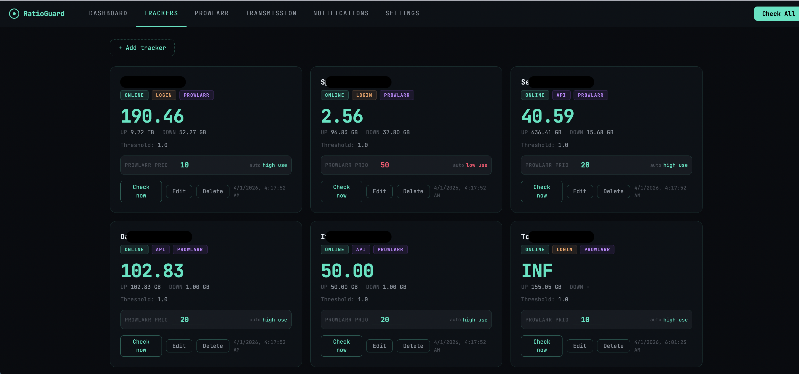

# RatioGuard

Self-hosted ratio monitor for private torrent trackers, with Prowlarr and Transmission integration.



## Features

- Ratio monitoring per tracker (Cookie, Login, API auth methods)
- Prowlarr integration - auto-sync indexer priorities based on ratio
- Transmission integration - seeding recommendations and automatic bandwidth priority management
- Discord notifications when ratio drops below threshold
- Dashboard with ratio history chart and Prowlarr activity stats
- Home Assistant sensors via REST API

## Stack

- **Backend**: FastAPI + SQLite (SQLAlchemy async)
- **Frontend**: React + Tailwind CSS
- **Deployment**: Docker Compose

## Installation

### 1. Clone the repository
```bash
git clone https://github.com/yourusername/ratioguard.git
cd ratioguard
```

### 2. Create the .env file
```bash
cp .env.example .env
```

Edit `.env` with your values:
```env
SECRET_KEY=your-random-secret-key
TRANSMISSION_URL=http://localhost:9091/transmission/rpc
TRANSMISSION_USER=your-username
TRANSMISSION_PASS=your-password
```

### 3. Build the frontend
```bash
cd frontend
npm install
npm run build
cd ..
```

### 4. Start
```bash
docker compose up -d
```

Access the UI at `http://localhost:7990`

## Initial setup

### Trackers

Go to the **Trackers** tab and add your trackers. Three authentication methods are supported:

- **Cookie** - for trackers behind Cloudflare. Copy cookies from your browser's DevTools.
- **Login** - username and password. Does not work with Cloudflare or CAPTCHA.
- **API** - for trackers with an API key (Seedpool, Darkpeers, ItaTorrents, etc.)

### Prowlarr

In **Settings**, enter your Prowlarr URL and API key. After saving, go to the **Prowlarr** tab and link each indexer to its corresponding tracker. Priorities will update automatically after each ratio check.

### Transmission

In **Settings**, enter your Transmission URL, username and password (leave blank if authentication is disabled). Go to the **Transmission** tab for seeding recommendations and bandwidth priority management.

### Discord notifications

In **Settings**, enter your Discord Webhook URL. You will receive an alert whenever a tracker's ratio drops below its configured threshold.

### Home Assistant

A dedicated endpoint is available at `/api/dashboard/ha-sensors`. Example `sensors.yaml`:
```yaml
- platform: rest
  name: "RatioGuard Filelist"
  resource: http://YOUR_IP:7990/api/dashboard/ha-sensors
  scan_interval: 3600
  value_template: "{{ (value_json | selectattr('name', 'eq', 'Filelist') | list | first).ratio }}"
  unit_of_measurement: "ratio"
```

## Updating
```bash
git pull
cd frontend && npm run build && cd ..
docker compose down
docker compose up -d
```

## Tested trackers

| Tracker | Method |
|---------|--------|
| FileList.io | Login |
| SpeedApp.io | Login |
| Seedpool.org | API |
| DarkPeers.org | API |
| ItaTorrents.xyz | API |
| TorrentLeech | Login |
| Upload.cx | API |
| HD-Space | Cookie |

## Project structure
```
ratioguard/
├── backend/
│   └── app/
│       ├── api/          # FastAPI routers
│       ├── core/         # Config, Database, Scheduler
│       ├── models/       # Pydantic schemas
│       ├── scrapers/     # Universal ratio scraper
│       └── services/     # Checker, Prowlarr, Transmission
├── frontend/
│   └── src/
│       ├── hooks/        # API client
│       └── pages/        # React pages
├── nginx/
├── .env.example
├── docker-compose.yml
└── README.md
```

## License

MIT
